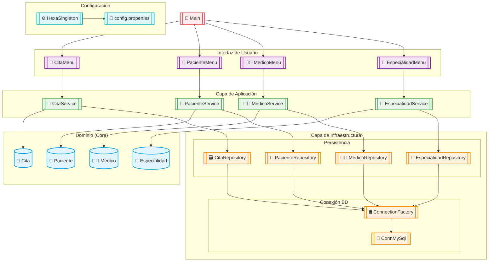
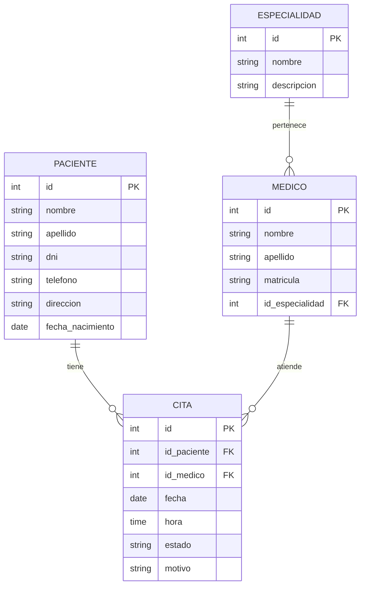

# 🏥 Sistema de Control de Citas Médicas

## 📌 Descripción del Proyecto
El Sistema de Control de Citas Médicas es una solución integral diseñada para optimizar la gestión de pacientes, médicos, especialidades y citas en entornos de salud, implementando una arquitectura hexagonal robusta y patrones de diseño avanzados.

## 🏗️ Arquitectura del Sistema

### 🔷 **Arquitectura Hexagonal**
Implementamos una arquitectura limpia que separa:
- **Núcleo del negocio** (dominio)
- **Casos de uso** (lógica de aplicación)
- **Infraestructura** (adaptadores externos)

### 🧩 **Patrones Implementados**
- **Factory Method** para conexiones a BD
- **Singleton** para configuración global
- **Repository** para acceso a datos

## 🗂️ Estructura del Proyecto

```plaintext
📦 skeletonhexa-app
├── 📂 src/main/java
│   ├── 📂 com.SistemaDegestionMedica
│   │   ├── 📂 adapter.ui
│   │   │   ├── 🩺 CitaMenu
│   │   │   ├── 🏥 EspacialidadMenu
│   │   │   ├── 👨‍⚕️ MedicoMenu
│   │   │   └── 👤 PacienteMenu
│   │   ├── 📂 application/usecase
│   │   │   ├── 📅 CitaService
│   │   │   ├── 🏥 EspacialidadService
│   │   │   ├── 👨‍⚕️ MedicoService
│   │   │   └── 👤 PacienteService
│   │   ├── 📂 config
│   │   │   ├── ⚙️ HexaSingleton
│   │   │   └── 📂 domain.entities
│   │   │       ├── 📅 Cita
│   │   │       ├── 🏥 Espacialidad
│   │   │       ├── 👨‍⚕️ Medico
│   │   │       └── 👤 Paciente
│   │   └── 📂 infrastructure.database
│   │       ├── 🛢️ ConnMySql
│   │       ├── 🔄 ConnectionFactory
│   │       ├── 📅 CitaRepository
│   │       ├── 🏥 EspacialidadRepository
│   │       ├── 📊 MainMenu
│   │       ├── 👨‍⚕️ MedicoRepository
│   │       ├── 🗃️ MySQLCitaRepository
│   │       └── 👤 MySQLPacienteRepository
└── 📂 src/main/resources
    └── ⚙️ config.properties
```

## 📊 Diagrama de Flujo del Sistema



## 🗃️ Diagrama Entidad-Relación



# 🏥 Sistema de Control de Citas Médicas - Base de Datos EPS

## 🗃️ Script de Base de Datos EPS

```sql
-- Creación de la base de datos EPS
CREATE DATABASE IF NOT EXISTS Eps;
USE Eps;

-- Tabla ESPECIALIDAD
CREATE TABLE Especialidad (
    id_especialidad INT AUTO_INCREMENT PRIMARY KEY,
    nombre VARCHAR(100) NOT NULL,
    descripcion TEXT
) ENGINE=InnoDB;

-- Tabla MEDICO
CREATE TABLE Medico (
    id_medico INT AUTO_INCREMENT PRIMARY KEY,
    nombre VARCHAR(100) NOT NULL,
    apellido VARCHAR(100) NOT NULL,
    matricula VARCHAR(50) UNIQUE NOT NULL,
    id_especialidad INT,
    FOREIGN KEY (id_especialidad) REFERENCES Especialidad(id_especialidad)
) ENGINE=InnoDB;

-- Tabla PACIENTE
CREATE TABLE Paciente (
    id_paciente INT AUTO_INCREMENT PRIMARY KEY,
    nombre VARCHAR(100) NOT NULL,
    apellido VARCHAR(100) NOT NULL,
    dni VARCHAR(20) UNIQUE NOT NULL,
    telefono VARCHAR(20),
    direccion TEXT,
    fecha_nacimiento DATE,
    tipo_afiliacion ENUM('Contributivo', 'Subsidiado') NOT NULL
) ENGINE=InnoDB;

-- Tabla CITA
CREATE TABLE Cita (
    id_cita INT AUTO_INCREMENT PRIMARY KEY,
    id_paciente INT NOT NULL,
    id_medico INT NOT NULL,
    fecha DATE NOT NULL,
    hora TIME NOT NULL,
    estado ENUM('Pendiente', 'Confirmada', 'Cancelada', 'Completada') DEFAULT 'Pendiente',
    motivo TEXT,
    FOREIGN KEY (id_paciente) REFERENCES Paciente(id_paciente),
    FOREIGN KEY (id_medico) REFERENCES Medico(id_medico)
) ENGINE=InnoDB;

-- INSERCIONES INICIALES

-- Especialidades
INSERT INTO Especialidad (nombre, descripcion) VALUES 
('Medicina General', 'Atención primaria de salud'),
('Pediatría', 'Atención médica para niños'),
('Ginecología', 'Salud reproductiva femenina'),
('Cardiología', 'Enfermedades del corazón'),
('Ortopedia', 'Problemas musculoesqueléticos');

-- Médicos
INSERT INTO Medico (nombre, apellido, matricula, id_especialidad) VALUES 
('Juan', 'Martínez', 'MG12345', 1),
('Ana', 'Gómez', 'PG54321', 2),
('Carlos', 'López', 'GG67890', 3),
('Sofía', 'Rodríguez', 'CG09876', 4),
('Pedro', 'Hernández', 'OG11223', 5);

-- Pacientes
INSERT INTO Paciente (nombre, apellido, dni, telefono, direccion, fecha_nacimiento, tipo_afiliacion) VALUES 
('María', 'García', '12345678', '3101234567', 'Calle 123 #45-67', '1985-05-15', 'Contributivo'),
('José', 'Pérez', '87654321', '3209876543', 'Av. Siempreviva 742', '1990-08-22', 'Subsidiado'),
('Laura', 'Sánchez', '56781234', '3156789012', 'Carrera 56 #12-34', '1978-11-30', 'Contributivo'),
('Carlos', 'Ramírez', '34567890', '3173456789', 'Diagonal 34 #56-78', '1995-03-10', 'Subsidiado');

-- Citas
INSERT INTO Cita (id_paciente, id_medico, fecha, hora, estado, motivo) VALUES 
(1, 1, '2023-11-15', '08:00:00', 'Confirmada', 'Control general'),
(2, 2, '2023-11-16', '09:30:00', 'Pendiente', 'Control niño sano'),
(3, 3, '2023-11-17', '10:00:00', 'Confirmada', 'Consulta ginecológica'),
(4, 4, '2023-11-18', '11:00:00', 'Pendiente', 'Dolor en el pecho'),
(1, 5, '2023-11-20', '14:00:00', 'Pendiente', 'Dolor en rodilla');

SELECT 'Base de datos EPS creada exitosamente con datos de prueba' AS Mensaje;
```

## 📝 Notas importantes

1. **Estructura de la base de datos**:
   - Nombre de la base de datos: `Eps`
   - Tablas principales: `Especialidad`, `Medico`, `Paciente`, `Cita`
   - Se utilizan convenciones de nombres consistentes (ej. `id_especialidad`)

2. **Características adicionales**:
   - Campo `tipo_afiliacion` en Paciente para el sistema EPS
   - Vista `VistaCitasPendientes` para consultas frecuentes
   - Datos de prueba para todas las tablas

3. **Recomendaciones de uso**:
   ```bash
   mysql -u usuario -p < script_eps.sql
   ```

4. **Configuración para la aplicación**:
   ```properties
   # En config.properties
   db.url=jdbc:mysql://localhost:3306/Eps
   db.username=tu_usuario
   db.password=tu_contraseña
   ```
## 🛠️ Tecnologías Utilizadas

| Tecnología | Uso |
|------------|-----|
| ☕ Java 17 | Lenguaje principal |
| 🛢️ MySQL | Base de datos |
| ⬢ Arquitectura Hexagonal | Organización del proyecto |
| 🏗️ Singleton | Configuración global |
| 🏭 Factory Method | Conexiones a BD |
| 📝 Maven | Gestión de dependencias |

## 🚀 Instalación y Configuración

### 📋 Requisitos Previos
- JDK 17+
- MySQL 8.0+
- Maven 3.8+

### 🔧 Pasos de Instalación

1. **Clonar repositorio**:
```bash
git clone https://github.com/tu-usuario/sistema-citas-medicas.git
```

2. **Configurar base de datos**:
```properties
# config.properties
db.url=jdbc:mysql://localhost:3306/clinica
db.user=usuario
db.password=contraseña
```

3. **Compilar proyecto**:
```bash
mvn clean install
```

4. **Ejecutar aplicación**:
```bash
java -jar target/sistema-citas.jar
```

## 📋 Ejemplo de Uso

```plaintext
=== SISTEMA DE CITAS MÉDICAS ===
1. Gestión de Pacientes
2. Gestión de Médicos
3. Gestión de Especialidades
4. Gestión de Citas
0. Salir

Seleccione opción: 1

=== GESTIÓN DE PACIENTES ===
1. Registrar nuevo paciente
2. Editar paciente existente
3. Buscar paciente
4. Listar todos
0. Volver

Seleccione opción: 1

Ingrese datos del paciente:
Nombre: Juan
Apellido: Pérez
DNI: 12345678
Teléfono: 555-1234
Dirección: Av. Principal 123
Fecha Nacimiento (YYYY-MM-DD): 1990-05-15

Paciente registrado exitosamente!
```

## 🌟 Características Clave

- **Modularidad**: Componentes desacoplados para fácil mantenimiento
- **Escalabilidad**: Diseñado para crecer con las necesidades de la clínica
- **Seguridad**: Validación de datos en todas las capas
- **Portabilidad**: Fácil cambio de motor de base de datos

## 📌 Notas Importantes

1. Antes de ejecutar, asegúrese de:
   - Tener MySQL en ejecución
   - Crear la base de datos con las tablas necesarias
   - Configurar correctamente el archivo `config.properties`

2. Para desarrollo en VS Code:
   - Instalar extensiones "Java Extension Pack" y "Maven for Java"
   - Configurar el JDK en settings.json

## 📜 Licencia

Este proyecto está bajo licencia MIT. Consulte el archivo LICENSE para más detalles.

---

✨ **Sistema desarrollado para optimizar la gestión médica con tecnología de punta** ✨