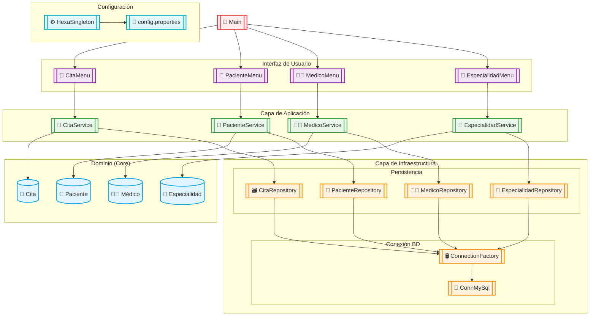
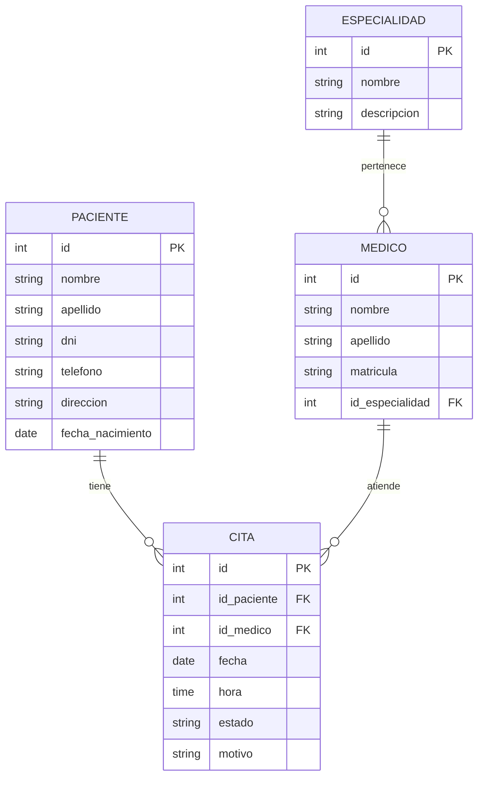

# 🏥 Sistema de Control de Citas Médicas

## 📌 Descripción del Proyecto

El Sistema de Control de Citas Médicas es una solución integral diseñada para optimizar la gestión de pacientes, médicos, especialidades y citas en entornos de salud, implementando una arquitectura hexagonal robusta y patrones de diseño avanzados.

## 🏗️ Arquitectura del Sistema


### 🔷 **Arquitectura Hexagonal**

Implementamos una arquitectura limpia que separa:
- **Núcleo del negocio** (dominio)
- **Casos de uso** (lógica de aplicación)
- **Infraestructura** (adaptadores externos)

### 🧩 **Patrones Implementados**
- **Factory Method** para conexiones a BD
- **Singleton** para configuración global
- **Repository** para acceso a datos

## 🗂️ Estructura del Proyecto

```plaintext
📦 skeletonhexa-app
├── 📂 src/main/java
│   ├── 📂 com.SistemaDegestionMedica
│   │   ├── 📂 adapter.ui
│   │   │   ├── 🩺 CitaMenu
│   │   │   ├── 🏥 EspacialidadMenu
│   │   │   ├── 👨‍⚕️ MedicoMenu
│   │   │   └── 👤 PacienteMenu
│   │   ├── 📂 application/usecase
│   │   │   ├── 📅 CitaService
│   │   │   ├── 🏥 EspacialidadService
│   │   │   ├── 👨‍⚕️ MedicoService
│   │   │   └── 👤 PacienteService
│   │   ├── 📂 config
│   │   │   ├── ⚙️ HexaSingleton
│   │   │   └── 📂 domain.entities
│   │   │       ├── 📅 Cita
│   │   │       ├── 🏥 Espacialidad
│   │   │       ├── 👨‍⚕️ Medico
│   │   │       └── 👤 Paciente
│   │   └── 📂 infrastructure.database
│   │       ├── 🛢️ ConnMySql
│   │       ├── 🔄 ConnectionFactory
│   │       ├── 📅 CitaRepository
│   │       ├── 🏥 EspacialidadRepository
│   │       ├── 📊 MainMenu
│   │       ├── 👨‍⚕️ MedicoRepository
│   │       ├── 🗃️ MySQLCitaRepository
│   │       └── 👤 MySQLPacienteRepository
└── 📂 src/main/resources
    └── ⚙️ config.properties
```

## 📊 Diagrama de Flujo del Sistema



## 🗃️ Diagrama Entidad-Relación



#  Base de Datos Eps

## 🗃️ Script de Base de Datos EPS

```sql
CREATE DATABASE Eps;
USE Eps;

-- Tabla especialidades

CREATE TABLE especialidades (
    id INT AUTO_INCREMENT PRIMARY KEY,
    nombre VARCHAR(100) NOT NULL UNIQUE,
    descripcion TEXT
) ENGINE=InnoDB;

-- Tabla medicos

CREATE TABLE medicos (
    id INT AUTO_INCREMENT PRIMARY KEY,
    nombre VARCHAR(100) NOT NULL,
    apellido VARCHAR(100) NOT NULL,
    documento VARCHAR(20) NOT NULL UNIQUE,
    telefono VARCHAR(15),
    email VARCHAR(100) NOT NULL UNIQUE,
    especialidad_id INT NOT NULL,
    horario_inicio TIME NOT NULL,
    horario_fin TIME NOT NULL,
    FOREIGN KEY (especialidad_id) REFERENCES especialidades(id),
    CONSTRAINT chk_horario_valido CHECK (horario_fin > horario_inicio),
    CONSTRAINT chk_email_valido CHECK (email LIKE '%@gmail.com')
) ENGINE=InnoDB;

-- Tabla pacientes

CREATE TABLE pacientes (
    id INT AUTO_INCREMENT PRIMARY KEY,
    nombre VARCHAR(100) NOT NULL,
    apellido VARCHAR(100) NOT NULL,
    documento VARCHAR(20) NOT NULL UNIQUE,
    telefono VARCHAR(15),
    email VARCHAR(100) NOT NULL UNIQUE,
    fecha_nacimiento DATE NOT NULL,
    tipo_afiliacion ENUM('Contributivo', 'Subsidiado') NOT NULL,
    CONSTRAINT chk_email_paciente_valido CHECK (email LIKE '%@gmail.com')
) ENGINE=InnoDB;

-- Tabla citas 

CREATE TABLE citas (
    id INT AUTO_INCREMENT PRIMARY KEY,
    paciente_id INT NOT NULL,
    medico_id INT NOT NULL,
    fecha_hora DATETIME NOT NULL,
    estado ENUM('Programada', 'Confirmada', 'Cancelada', 'Completada') DEFAULT 'Programada',
    motivo TEXT,
    FOREIGN KEY (paciente_id) REFERENCES pacientes(id),
    FOREIGN KEY (medico_id) REFERENCES medicos(id),
    CONSTRAINT uc_cita_unica UNIQUE (medico_id, fecha_hora)
) ENGINE=InnoDB;

-- Tabla de auditoría

CREATE TABLE auditoria_citas (
    id INT AUTO_INCREMENT PRIMARY KEY,
    cita_id INT NOT NULL,
    fecha_cambio DATETIME NOT NULL DEFAULT CURRENT_TIMESTAMP,
    usuario VARCHAR(50) NOT NULL,
    campo_modificado VARCHAR(50) NOT NULL,
    valor_anterior TEXT,
    valor_nuevo TEXT,
    FOREIGN KEY (cita_id) REFERENCES citas(id)
) ENGINE=InnoDB;

-- Trigger para validar fecha futura 

DELIMITER //
CREATE TRIGGER validar_fecha_cita
BEFORE INSERT ON citas
FOR EACH ROW
BEGIN
    IF NEW.fecha_hora <= NOW() THEN
        SIGNAL SQLSTATE '45000' 
        SET MESSAGE_TEXT = 'Error: La fecha/hora de la cita debe ser en el futuro';
    END IF;
END//
DELIMITER ;

-- Trigger para actualizaciones de fecha

DELIMITER //
CREATE TRIGGER validar_fecha_cita_update
BEFORE UPDATE ON citas
FOR EACH ROW
BEGIN
    IF NEW.fecha_hora <= NOW() THEN
        SIGNAL SQLSTATE '45000' 
        SET MESSAGE_TEXT = 'Error: La fecha/hora de la cita debe ser en el futuro';
    END IF;
END//
DELIMITER ;

-- Trigger para auditoría

DELIMITER //
CREATE TRIGGER auditoria_cambios_cita
AFTER UPDATE ON citas
FOR EACH ROW
BEGIN
    IF OLD.estado <> NEW.estado THEN
        INSERT INTO auditoria_citas (cita_id, usuario, campo_modificado, valor_anterior, valor_nuevo)
        VALUES (NEW.id, CURRENT_USER(), 'estado', OLD.estado, NEW.estado);
    END IF;
    
    IF OLD.fecha_hora <> NEW.fecha_hora THEN
        INSERT INTO auditoria_citas (cita_id, usuario, campo_modificado, valor_anterior, valor_nuevo)
        VALUES (NEW.id, CURRENT_USER(), 'fecha_hora', OLD.fecha_hora, NEW.fecha_hora);
    END IF;
END//
DELIMITER ;

-- Datos de prueba para especialidades

INSERT INTO especialidades (nombre, descripcion) VALUES 
('Cardiología', 'Especialidad en enfermedades del corazón'),
('Pediatría', 'Especialidad en atención infantil'),
('Dermatología', 'Especialidad en enfermedades de la piel'),
('Ginecología', 'Especialidad en salud femenina'),
('Traumatología', 'Especialidad en sistema musculoesquelético');

-- Datos de prueba para médicos

INSERT INTO medicos (nombre, apellido, documento, email, especialidad_id, horario_inicio, horario_fin) VALUES 
('Juan Carlos', 'Martínez', '12345678', 'juan.martinez@gmail.com', 1, '08:00:00', '16:00:00'),
('María Elena', 'Gómez', '23456789', 'maria.gomez@gmail.com', 2, '09:00:00', '17:00:00'),
('Carlos Andrés', 'López', '34567890', 'carlos.lopez@gmail.com', 3, '08:30:00', '16:30:00'),
('Ana Patricia', 'Rodríguez', '45678901', 'ana.rodriguez@gmail.com', 4, '10:00:00', '18:00:00'),
('Pedro Antonio', 'Hernández', '56789012', 'pedro.hernandez@gmail.com', 5, '07:00:00', '15:00:00');

-- Datos de prueba para pacientes

INSERT INTO pacientes (nombre, apellido, documento, telefono, email, fecha_nacimiento, tipo_afiliacion) VALUES 
('Laura', 'García', '11223344', '3101111111', 'laura.garcia@gmail.com', '1985-05-15', 'Contributivo'),
('José', 'Pérez', '22334455', '3202222222', 'jose.perez@gmail.com', '1990-08-22', 'Subsidiado'),
('Sofía', 'Sánchez', '33445566', '3153333333', 'sofia.sanchez@gmail.com', '1978-11-30', 'Contributivo'),
('Diego', 'Ramírez', '44556677', '3174444444', 'diego.ramirez@gmail.com', '1995-03-10', 'Subsidiado'),
('Valentina', 'Torres', '55667788', '3185555555', 'valentina.torres@gmail.com', '1982-07-25', 'Contributivo');

-- Datos de prueba para citas (usando fechas futuras)

INSERT INTO citas (paciente_id, medico_id, fecha_hora, estado, motivo) VALUES 
(1, 1, DATE_ADD(NOW(), INTERVAL 2 DAY), 'Programada', 'Control cardiológico'),
(2, 2, DATE_ADD(NOW(), INTERVAL 3 DAY), 'Confirmada', 'Control pediátrico'),
(3, 3, DATE_ADD(NOW(), INTERVAL 4 DAY), 'Programada', 'Consulta dermatológica'),
(4, 4, DATE_ADD(NOW(), INTERVAL 5 DAY), 'Confirmada', 'Consulta ginecológica'),
(5, 5, DATE_ADD(NOW(), INTERVAL 6 DAY), 'Programada', 'Dolor en rodilla');

-- Vista para citas programadas

CREATE VIEW vw_citas_programadas AS
SELECT c.id, 
       CONCAT(p.nombre, ' ', p.apellido) AS paciente,
       CONCAT(m.nombre, ' ', m.apellido) AS medico,
       e.nombre AS especialidad,
       DATE_FORMAT(c.fecha_hora, '%d/%m/%Y %H:%i') AS fecha_hora,
       c.estado, c.motivo
FROM citas c
JOIN pacientes p ON c.paciente_id = p.id
JOIN medicos m ON c.medico_id = m.id
JOIN especialidades e ON m.especialidad_id = e.id
WHERE c.estado IN ('Programada', 'Confirmada');

-- Mensaje de confirmación

SELECT 'Tablas creadas: especialidades, medicos, pacientes, citas, auditoria_citas' AS Tablas;

SELECT 'Triggers creados: validar_fecha_cita, validar_fecha_cita_update, auditoria_cambios_cita' AS Triggers;

SELECT 'Vista creada: vw_citas_programadas' AS Vistas;

SELECT 'Base de datos EPS creada exitosamente con datos de prueba ve a visual studio code y ejecuta MainMenu' AS Mensaje;
```

## 📝 Notas importantes

1. **Estructura de la base de datos**:
   - Nombre de la base de datos: `Eps`
   - Tablas principales: `Especialidad`, `Medico`, `Paciente`, `Cita`
   - Se utilizan convenciones de nombres consistentes (ej. `id_especialidad`)

2. **Características adicionales**:
   - Campo `tipo_afiliacion` en Paciente para el sistema EPS
   - Vista `VistaCitasPendientes` para consultas frecuentes
   - Datos de prueba para todas las tablas

3. **Recomendaciones de uso**:
   ```bash
   mysql -u usuario -p < script_eps.sql
   ```

4. **Configuración para la aplicación**:
   ```properties
   # En config.properties
   db.url=jdbc:mysql://localhost:3306/Eps
   db.username=tu_usuario
   db.password=tu_contraseña
   ```
## 🛠️ Tecnologías Utilizadas

| Tecnología | Uso |
|------------|-----|
| ☕ Java 17 | Lenguaje principal |
| 🛢️ MySQL | Base de datos |
| ⬢ Arquitectura Hexagonal | Organización del proyecto |
| 🏗️ Singleton | Configuración global |
| 🏭 Factory Method | Conexiones a BD |
| 📝 Maven | Gestión de dependencias |

## 🚀 Instalación y Configuración

### 📋 Requisitos Previos
- JDK 17+
- MySQL 8.0+
- Maven 3.8+

### 🔧 Pasos de Instalación

1. **Clonar repositorio**:
```bash
git clone https://github.com/tu-usuario/sistema-citas-medicas.git
```

2. **Configurar base de datos**:
```properties
# config.properties
db.url=jdbc:mysql://localhost:3306/clinica
db.user=usuario
db.password=contraseña
```

3. **Compilar proyecto**:
```bash
mvn clean install
```

4. **Ejecutar aplicación**:
```bash
java -jar target/sistema-citas.jar
```

## 📋 Ejemplo de Uso

```plaintext
=== SISTEMA DE CITAS MÉDICAS ===
1. Gestión de Pacientes
2. Gestión de Médicos
3. Gestión de Especialidades
4. Gestión de Citas
0. Salir

Seleccione opción: 1

=== GESTIÓN DE PACIENTES ===
1. Registrar nuevo paciente
2. Editar paciente existente
3. Buscar paciente
4. Listar todos
0. Volver

Seleccione opción: 1

Ingrese datos del paciente:
Nombre: Juan
Apellido: Pérez
DNI: 12345678
Teléfono: 555-1234
Dirección: Av. Principal 123
Fecha Nacimiento (YYYY-MM-DD): 1990-05-15

Paciente registrado exitosamente!
```

## 🌟 Características Clave

- **Modularidad**: Componentes desacoplados para fácil mantenimiento
- **Escalabilidad**: Diseñado para crecer con las necesidades de la clínica
- **Seguridad**: Validación de datos en todas las capas
- **Portabilidad**: Fácil cambio de motor de base de datos

## 📌 Notas Importantes

1. Antes de ejecutar, asegúrese de:
   - Tener MySQL en ejecución
   - Crear la base de datos con las tablas necesarias
   - Configurar correctamente el archivo `config.properties`

2. Para desarrollo en VS Code:
   - Instalar extensiones "Java Extension Pack" y "Maven for Java"
   - Configurar el JDK en settings.json

## 📜 Licencia

Este proyecto está bajo licencia MIT. Consulte el archivo LICENSE para más detalles.

---
🚨 **Estado del Ejercicio**  
Culminado.  

👤 **Autor**  
Jhorman Jesús Castellanos Morales  
